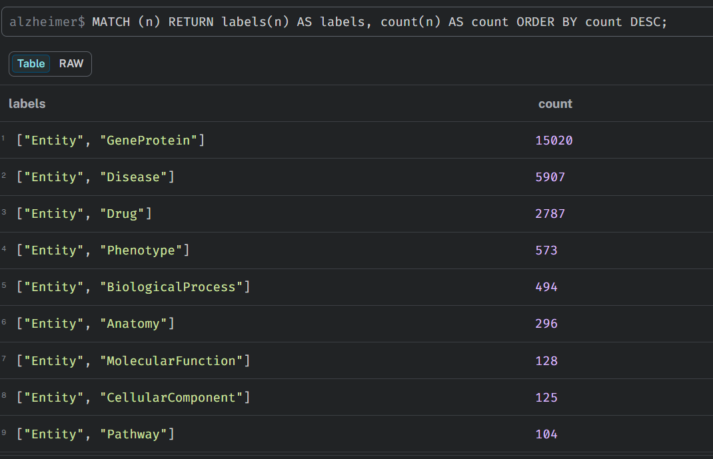
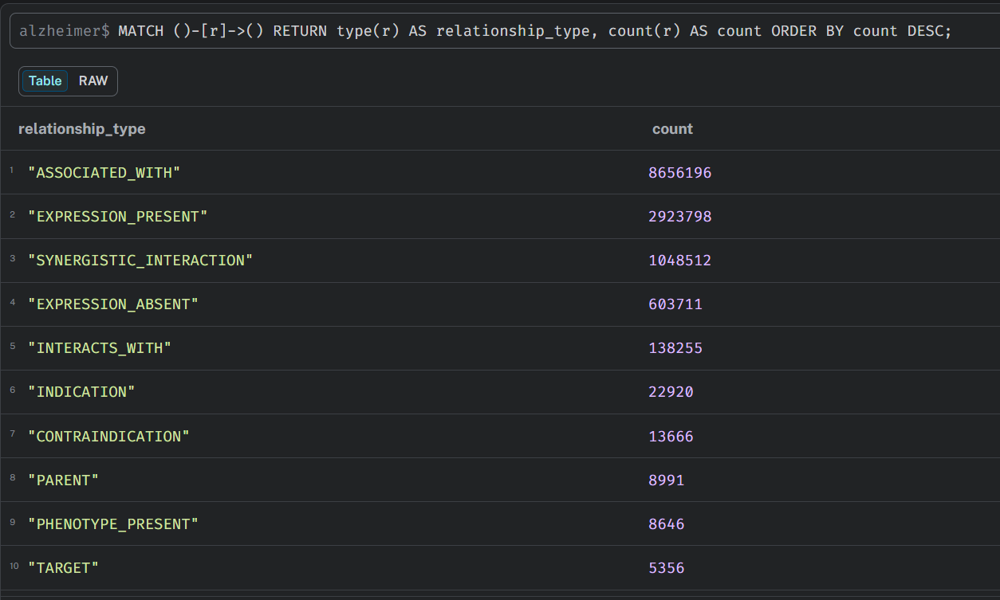
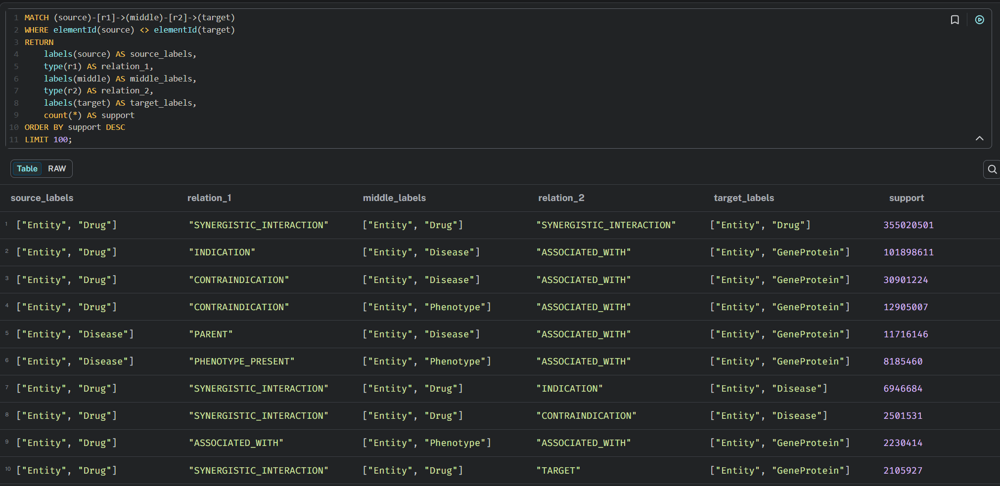
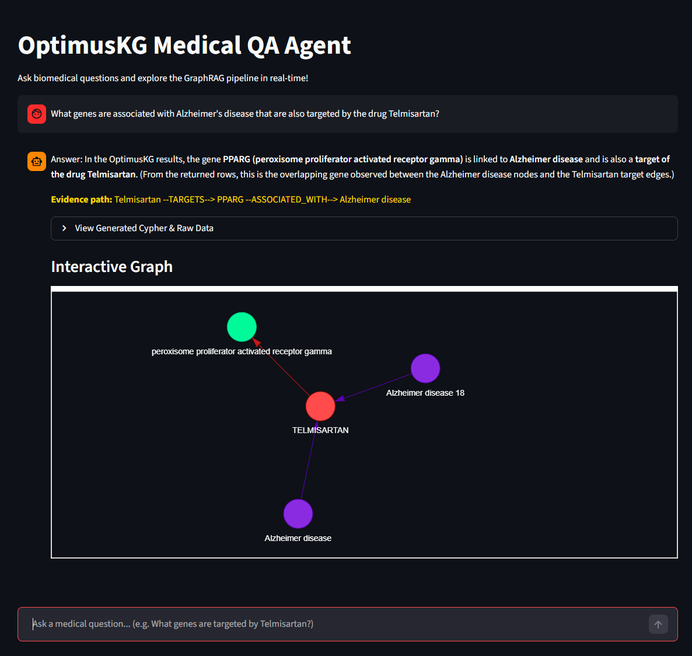
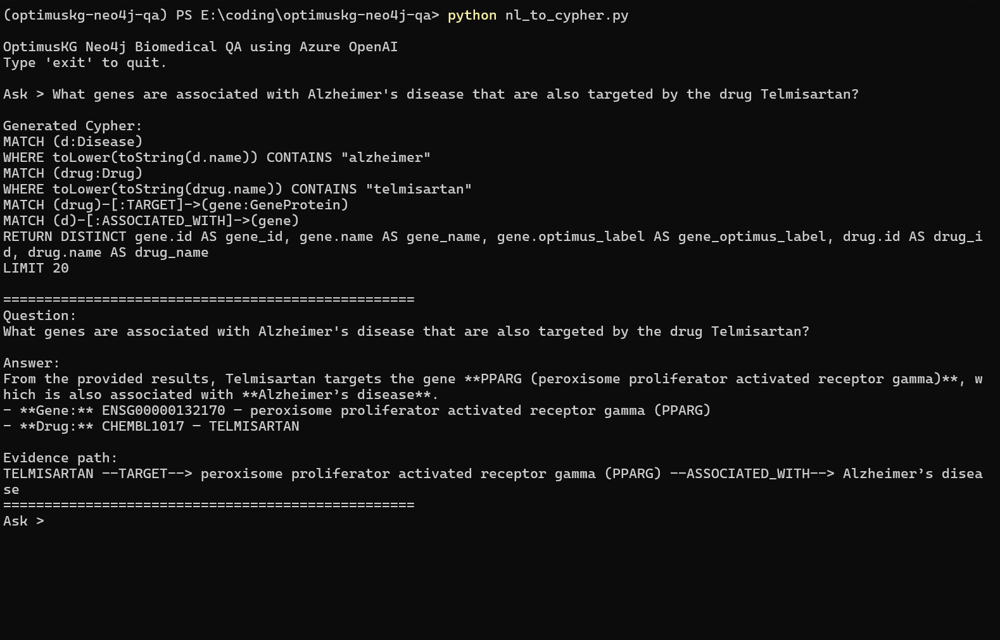
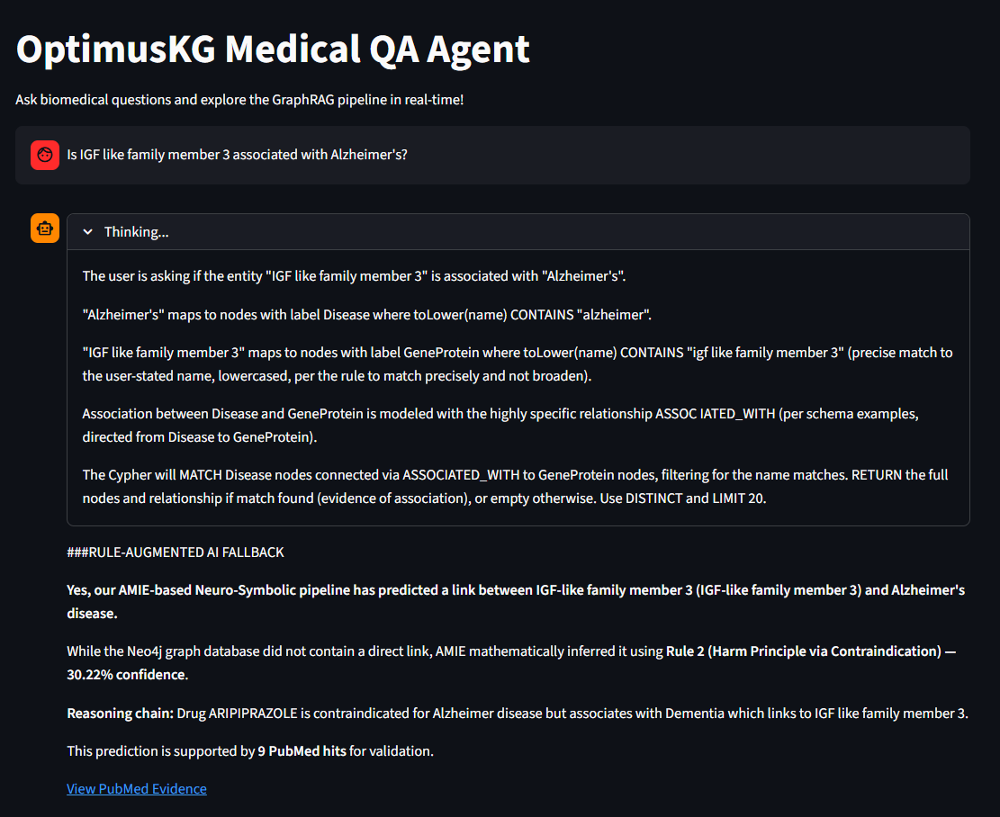

# OptimusKG Neo4j QA — Neuro-Symbolic Biomedical Discovery Engine

A full end-to-end pipeline for extracting a disease-specific subgraph from [OptimusKG](https://github.com/microsoft/OptimusKG) (190K nodes, 21M edges across 65 biomedical databases), mining logical rules with AMIE, predicting novel drug-disease associations, validating them against PubMed, and surfacing them through a Neuro-Symbolic QA chatbot with Chain-of-Thought reasoning.

---

## 🚀 The Pipeline

### 1. Subgraph Extraction (`scripts/get_optimuskg.py`)
Extracts a focused **1-hop induced subgraph** for Alzheimer's Disease from the full OptimusKG using **Polars** for memory efficiency.
- Discovers nodes with "alzheimer" in any property field.
- Expands to 1-hop neighbors, filters by allowed node types (`DIS`, `DRG`, `GEN`, etc.).
- Removes protein-protein edges to reduce noise.
- **Output:** `data/alzheimer_nodes.csv`, `data/alzheimer_edges.csv`

### 2. Neo4j Ingestion (`scripts/ingest_optimuskg.py`)
Streams the CSVs into a local Neo4j database using optimized batched writes.
- **Pandas chunking** prevents memory crashes on large files.
- **`UNWIND` batching** — 10,000 rows per transaction (~100× faster than row-by-row).
- Unique ID constraints for lightning-fast deduplication.
- **Result:** ~10K nodes, **13.4M edges**, 32 relationship types in the `alzheimer` database.

### 3. Graph Auditing (`cypher/`)
Cypher scripts to validate the ingested graph and discover structural meta-paths.


*(Above: Node taxonomy confirming the presence of Diseases, Genes, and Drugs)*


*(Above: Relationship distribution across all 32 edge types)*


*(Above: Highest-frequency 2-hop meta-paths — Drug → Disease → Gene)*

### 4. AMIE Rule Mining (`scripts/export_for_amie.py`, `scripts/run_amie.py`)
Exports the graph as a TSV of triples and runs [AMIE3](https://github.com/dig-team/amie) to mine logical Horn Rules under the **Open World Assumption**.

**6 rules discovered.** Key examples:

| Rule | Confidence | Name |
|---|---|---|
| `(?a PHENOTYPE_PRESENT ?f) ∧ (?f ASSOCIATED_WITH ?b) ⇒ (?a ASSOCIATED_WITH ?b)` | 99.99% | Phenotype Overlap |
| `(?a CONTRAINDICATION ?b) ∧ (?b ASSOCIATED_WITH ?c) ⇒ (?a ASSOCIATED_WITH ?c)` | 30.22% | **Harm Principle** |

### 5. Link Prediction (`scripts/predict_links.py`)
Applies the 6 mined rules against the graph to find **edges that logically should exist but don't**.
- **223 novel associations** predicted across all rules.

### 6. PubMed Validation (`scripts/validate_predictions.py`)
Cross-references each unique predicted target against the **PubMed API** (NCBI E-utilities).
- **155 unique targets** queried.
- **80/155 (>51%) confirmed** with at least 1 published paper.
- Top result: **cyclin F** — predicted via the Harm Principle (ARIPIPRAZOLE pathway), confirmed by **19 PubMed papers**.

### 7. Neuro-Symbolic QA Agent (`nl_to_cypher.py`, `app.py`)
An interactive Streamlit chatbot combining symbolic graph retrieval with neural reasoning.

**Normal path:** Chain-of-Thought reasoning (Grok) → Cypher → Neo4j → LLM summary + graph visualization.

**Fallback path:** When Neo4j returns 0 rows, `check_ai_predictions()` cross-references AMIE validated predictions and returns:
- The exact AMIE rule that predicted the link
- Its confidence score
- The intermediate reasoning chain
- The PubMed hit count
- A live PubMed search link


*(Above: The Streamlit dashboard with interactive graph visualization)*


*(Above: The agent discovering Telmisartan targets PPARG, a gene associated with Alzheimer's)*


*(Above: Fallback triggered for cyclin F — Harm Principle, 30.22% confidence, 19 PubMed papers)*

---

## 🛠️ Setup & Usage

### 1. Install Dependencies
```bash
uv sync
```

### 2. Environment Variables
Create a `.env` file:
```env
NEO4J_URI=bolt://localhost:7687
NEO4J_USER=neo4j
NEO4J_PASSWORD=your_password
NEO4J_DATABASE=alzheimer

# Any OpenAI-compatible endpoint (Grok, Azure OpenAI, etc.)
AZURE_OPENAI_API_KEY=your_key
AZURE_OPENAI_ENDPOINT=your_endpoint
AZURE_OPENAI_DEPLOYMENT=your_model_name
```

### 3. Run the Pipeline
```bash
# Step 1: Extract Alzheimer's subgraph
uv run python scripts/get_optimuskg.py

# Step 2: Ingest into Neo4j
uv run python scripts/ingest_optimuskg.py

# Step 3: Export for AMIE and run rule mining
uv run python scripts/export_for_amie.py
uv run python scripts/run_amie.py

# Step 4: Predict missing links
uv run python scripts/predict_links.py

# Step 5: Validate predictions against PubMed
uv run python scripts/validate_predictions.py
```

### 4. Launch the QA Agent
```bash
# Streamlit UI
uv run streamlit run app.py

# CLI
uv run python nl_to_cypher.py
```

---

## 📖 Documentation

See [`about.md`](about.md) for the full pipeline architecture, rule table, validation results breakdown by rule, live demo transcript, and known limitations.

See [`TODO.md`](TODO.md) for the research roadmap including 2-hop Diabetes extraction, relationship ontology cleanup, and full-graph AMIE scaling on the university cluster.
